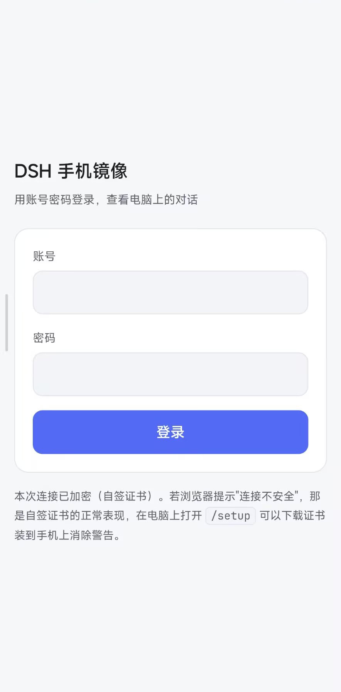
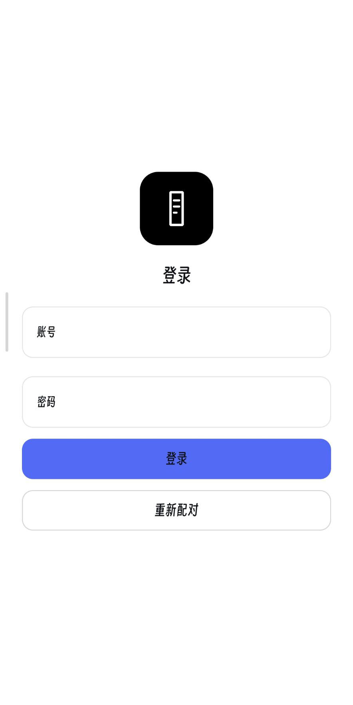
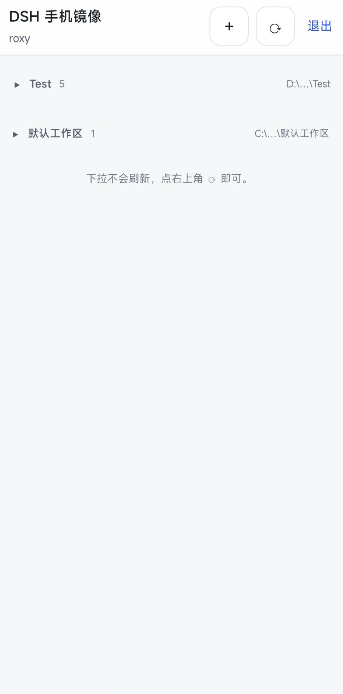
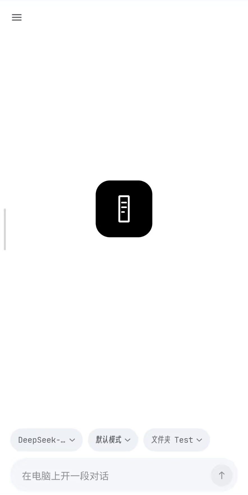
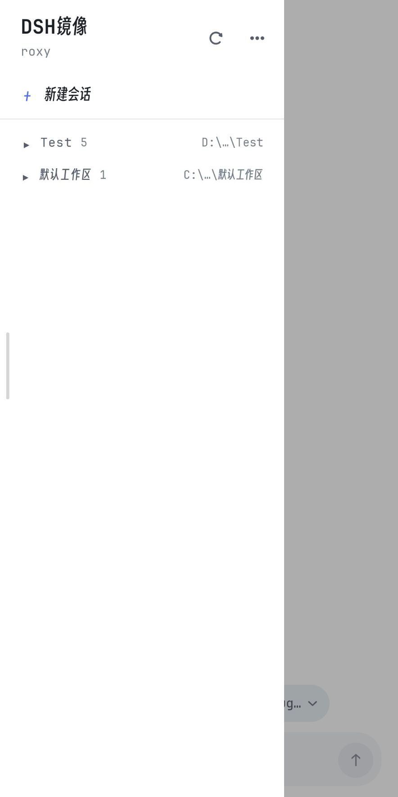

#  DSH镜像 · dsh-mobile-mirror

[](package.json)
[](docs/apk-plan.md)
[](docs/client-plan.md)
[](LICENSE)
[](#环境要求)
[](#通知与超级岛)
[](#装-apk可选)

在局域网里用手机镜像 **DSH（DeepSeek Harness）** 的会话：看会话列表（按工作区分组）、看历史、
看**实时逐字输出**，以及**发消息**、**停止当前轮**、**新建会话**、**切换会话的模型与模式**、
**在手机上回答 DSH 的提问**。

**桌面端行为完全不变** —— 不注入 UI、不遮挡、不改布局。手机页面走自己的端口，
DSH 现有 webServer 的 host / port / 既有行为一律不动（只额外挂一条**只读、仅回环**的
JSON 路由给桌面设置面板取地址）。

> ### 适配与测试范围
> 本项目只在 **DSH Windows 桌面端 `0.2.0-rc.2»** + **小米 HyperOS 3** 上实测通过。
> **其他 DSH 版本、其他 ROM、其他 Android 机型都没有验证过。**
> 插件接入用的都是公开接口（`dsh.bundle.patch» 与 `dsh.client»），换版本理论上也能装，但没测过就是没测过。
>
> ### ⚠️ 1.0 起包名去掉了 `dev.»
> 两个 APK 的包名现在是 **`dsh.mirror»**（外壳）与 **`dsh.mirror.client»**（原生），显示名都是「**DSH镜像**」。
> 对 1.0 之前装过的人来说，这是**两个新 App**：**旧包要手动卸载**，配对与登录状态要**重来一次**
> （状态存在旧包名下），系统里的通知权限（含 HyperOS 的「焦点通知」）也要重新给。

---

## 目录

- [三个面：网页、外壳 APK、原生 APK](#三个面网页外壳-apk原生-apk)
- [截图](#截图)
- [两种 APK 的异同](#两种-apk-的异同)
- [特性](#特性)
- [为什么是独立端口 / 为什么有 HTTPS](#为什么是独立端口--为什么有-https)
- [环境要求](#环境要求)
- [安装](#安装)
- [首次使用：设置账号密码](#首次使用设置账号密码)
- [手机访问](#手机访问)
- [装 APK（可选）](#装-apk可选)
- [配置](#配置)
- [安全边界（摘要）](#安全边界摘要)
- [开发与测试](#开发与测试)
- [常见问题](#常见问题)
- [目录结构](#目录结构)
- [特别鸣谢](#特别鸣谢)
- [许可证](#许可证)

---

## 三个面：网页、外壳 APK、原生 APK

同一份协议、同一份数据，三种用法：

| | 网页端 | WebView 外壳 APK | 原生客户端 APK |
|---|---|---|---|
| **是什么** | 手机浏览器打开手机页面 | 把手机页面装进 App | Kotlin + Compose 重写的原生界面 |
| **装什么** | 什么都不用装 | `dsh-mobile-mirror-1.1.6.apk»（**78 KB**） | `dsh-mobile-mirror-client-1.0.apk»（**23.8 MB**） |
| **包名** | —（浏览器） | `dsh.mirror» | `dsh.mirror.client» |
| **显示名** | — | **DSH镜像** | **DSH镜像** |
| **界面从哪来** | 插件的 `lib/web/»，**改完刷新页面即生效** | 同网页端（App 只是个壳） | 打进 APK 里，**改界面要重新出包** |
| **为什么存在** | 零安装、任何手机都能用 | 网页做不到的三件事：证书固定、通知、超级岛 | 原生手感 + 网页做不出来的交互（见下） |

---

## 截图

左边是**网页端**（手机浏览器），右边是**原生客户端**（装 APK）。两边看到的是**同一份数据**。

| 网页端 · 登录 | 原生客户端 · 登录 |
|---|---|
|  |  |

| 网页端 · 会话列表 | 原生客户端 · 会话 |
|---|---|
|  |  |

| 原生客户端 · 侧栏（会话列表 / 更多 / 字体 / 开源许可都住在这儿） |
|---|
|  |

---

## 两种 APK 的异同

### 相同（因为共用同一个 `:core» 平台层）

- **同一条协议、同一个端口、同一份账号口令**；都只连局域网，**不做任何内网穿透**
- **证书指纹固定（TOFU）** —— 不用给手机装系统 CA，信任只给这个 App
- **通知** —— 前台服务轮询两个只读端点，DSH 提问或一轮跑完时，锁屏也能知道
- **超级岛** —— 有会话在跑就上岛、岛上显示会话标题、出现提问时变色（仅 HyperOS 3 实测）
- 都**不碰** DSH 的 webServer；关掉插件，两边一起消失

### 不同

| 维度 | WebView 外壳 | 原生客户端 |
|---|---|---|
| 界面技术 | 网页（HTML / CSS / JS） | Kotlin + Compose |
| 体积 | **78 KB** | **23.8 MB**（其中约 20 MB 是内置字体） |
| **插件更新之后** | **界面自动跟着变**（重开 App 即可） | 界面**不变**，要等新的 APK |
| 主题 | 跟随系统深浅色 | **只有浅色**（刻意与网页端不同） |
| 字体 | 内嵌 JetBrains Mono，中文用系统字体 | **三档内置字体**（界面 / 正文 / 等宽），可换可导入 |
| 提问 | 网页版提问卡（底部弹出 + `hold» 认领） | 原生提问卡 + 会话列表角标 |
| 模型 / 模式 | 顶栏胶囊 | 输入条上方**三颗胶囊**（模型 / 模式 / 文件夹）+ 就地面板 |
| 原生独有 | — | 「已发消息」清单与 ↑ 浮键、长按归档空白会话、输入框多行扩容 |
| 冷启动 | WebView 里重新加载页面 | 可被通知**直接带进某个会话** |

> **同一时刻只建议装一支。** 两个 App 都起前台服务轮询，同时开着且都有会话在跑时，
> 你会看到**两条常驻通知**。功能上原生客户端是外壳的超集 —— 推荐只装它。

---

## 特性

### 网页端（`https://<电脑局域网IP>:19388/»）

| 能力 | 说明 |
|---|---|
| 会话列表 | 按工作区分组、可折叠（折叠状态记在 `localStorage»）、**子智能体会话不显示**（按用户要求彻底隐藏） |
| 实时输出 | SSE 逐字推送；切后台回来自动补齐，不丢不重 |
| 发消息 | 幂等（`requestId»）+ 每会话 300ms 节流；弱网重发不会重复发出 |
| 停止当前轮 | **页面内**二次确认：点一下按钮变成「确认停止？」，3 秒内再点才真停。不用原生弹窗 —— APK 的 WebView 没接管 `onJsConfirm»，`window.confirm» 在那里恒为 false，点了等于没点 |
| 新建会话 | 从工作区清单里选，或手输任意绝对路径（一个会话都没有的新文件夹也能开） |
| 模型 / 模式 | 切换会话的模型（含推理档位）与模式（标准 / PTC / 极简 / 创造 + 自建） |
| 回答提问 | 手机与桌面谁先答谁生效；桌面 GUI 没开时手机照样能答。配成限时提问（`mode: timed»）时，手机看着卡片期间会**接管等待**，从容作答也不会掉进"迟到回复"；切后台 / 离开聊天页立刻放开，不会把 agent 卡住 |
| **贴文件 / 下载** | 助手产出的文件（`present» 工具）在消息里显示成**文件卡**：文件名 + 说明 + 「下载」，点一下就从电脑下载到本机（同源下载口，不需要额外授权；原生端早就有，1.0 起网页端也有） |
| 快捷跳转 | 右侧刻度条只标**我自己说过的话**：说过两句以上才出现，点一下跳过去、按住先看那句原话、滚动时高亮当前那句 |
| 收起提问卡片 | 卡片紧贴输入框上方，不收起来会一直挤占消息区；收起后只剩标题 + 还剩几题，换新问题自动展开 |
| 工作过程折叠 | 一轮里的**思考与命令**收进同一张「工作过程」折叠卡：正在跑时展开、回答结束自动折起，标题上留着件数 |
| 长内容不截断 | 正文 / 思考上限 100000 字符、工具参数 20000 字符、请求体 1MB —— 长回答与长粘贴不再被截掉 |
| Markdown | 标题 / 列表 / 表格 / 任务列表 / 引用 / 代码块（带语言名与复制键），手写实现 |
| 主题 | 深浅两套跟随系统；内嵌 JetBrains Mono（**只用于代码**） |
| 干净的消息流 | AGENTS.md、运行时上下文、技能目录等**注入内容在宿主侧就被丢掉**，手机上只剩真人说的话 |

### 原生客户端在网页端之上多出来的

| 能力 | 说明 |
|---|---|
| 原生界面 | 整套 UI 用 Compose 重写，**只有浅色主题**（用户指定，与网页端跟随系统不同） |
| 字体三档 | **界面 / 正文 / 等宽**三档，每档可选内置 / 系统 / 自定义字体文件；内置**得意黑**（界面中文）、**思源黑体**（正文中文）、**JetBrains Mono**（等宽，三个真字重） |
| 「已发消息」 | 顶栏入口 + 就地展开的清单，点一句跳过去；右下角还有个 ↑ 浮键兜底（不必为了找自己那句话一直往上翻） |
| 长按归档 | 长按会话列表里的一行即可归档（只放行**空白会话**；DSH 没有真删接口，归档就是软删除） |
| 输入框多行 | 输入框到 5 行封顶、长文自动换行并使输入框长高，封顶后框内自己滚（1.0 起） |
| 通知 / 超级岛 | 见下 |
| 字号与动效 | 系统字号跟随；抽屉与页面切换的动效只动 `transform» / `opacity»，并尊重「减少动效」设置 |

### 通知与超级岛

超级岛（灵动岛那类能力）**只提一嘴**：它靠的是 HyperOS 的**焦点通知** —— 有会话在跑就上岛、
岛上显示会话标题、出现提问时变色、跑完 8 秒后自动收；「转圈」做不到（环只来自确定值进度弧，
所以颜色承担状态语义）。字段配方、四个设备门槛的取舍、踩过的坑见
[docs/apk-plan.md](docs/apk-plan.md) 的 §A3，这里不展开。

通知有两条：常驻的那条是**前台服务的载体**（也是岛的载体），提问 / 完成时另发一条会响会弹的提醒。
原生客户端按需起服务（有会话在跑或有问题在等才起），空闲 30 秒自己停 —— 常驻通知与岛一起消失。

### 桌面设置面板

DSH 设置里多一页「手机镜像」：手机访问地址（一键复制、按连通性排序、其他网卡可展开）、
本机设置页直达链接，以及协议 / 端口 / 账号 / 口令状态 / 证书指纹 / 有效期 / 在线会话数。
打开期间每 10 秒自动刷新，换 Wi-Fi 导致 IP 变了会自己跟上。

---

## 为什么是独立端口 / 为什么有 HTTPS

DSH 自己的 Web 服务只监听 `127.0.0.1»。把它的 `host» 改成 `0.0.0.0» 虽然一行配置就能让
手机打开完整 GUI，但那等于把**整个 GUI 和全部 `/api» 暴露到局域网**。

本插件换一条路：自己起一个只服务手机页面的小 HTTPS 服务（默认 `0.0.0.0:19388»），
只放行手机页面需要的接口，自带独立凭据。桌面 GUI 与 `/api» 的暴露面保持不变，
关掉插件就彻底消失。

局域网明文 HTTP 下，同一个 Wi-Fi 里任何能抓包的人都能拿到你的密码，所以默认走 TLS。
证书是**现场签发的自签证书**，不依赖 openssl、不引第三方包 —— `lib/asn1.js» + `lib/cert.js»
手写 DER 组装 X.509，`node:crypto» 生成密钥与签名。

---

## 环境要求

| 项 | 要求 |
|---|---|
| **DSH（桌面端）** | **`0.2.0-rc.2»（Windows）** —— 本项目**只测过这一个版本**。插件接口用 `dsh.bundle.patch» + `dsh.client»（桌面设置面板需要后者） |
| **手机** | 与电脑在**同一局域网**；iOS Safari / Android Chrome 均可 |
| **HyperOS** | 超级岛只在**小米 HyperOS 3** 上实测过（其他 ROM 没有岛） |
| Node.js | **>= 20** |
| npm 依赖 | **无**。宿主侧、页面、测试全部零第三方依赖 |
| 构建 APK（可选） | JDK **17 或 21**、Android SDK **Platform 36** + **Build-Tools 36**；原生客户端 minSdk 29（Android 10+） |

---

## 安装

本插件是 DSH bundle 插件，通过 profile 的 `package.json» 注册。
**把下面所有 `<路径>» 换成你克隆本仓库的实际绝对路径。**

### 1. 克隆

```bash
git clone https://github.com/ImHaoYuan/dsh-mobile-mirror.git
```

### 2A. 手动 link

编辑 DSH profile 的 `package.json»（默认 `~/.dsh/profiles/desktop/package.json»）：

```json
{
  "dependencies": {
    "dsh-mobile-mirror": "link:<你克隆到的绝对路径>"
  },
  "dsh": {
    "profile": {
      "bundles": [
        "...",
        "dsh-mobile-mirror"
      ]
    }
  }
}
```

然后在 profile 目录里建好链接（`npm install» / `pnpm install»），**重启 DSH**。

> Windows 上路径写成正斜杠或双反斜杠，例如 `link:D:/plugins/dsh-mobile-mirror»。

### 2B. 用 DSH 的插件管理器

```
plugin_manager install_bundle  target = link:<你克隆到的绝对路径>
```

它会自动改好 `package.json»、建好 `node_modules» 链接，并**热应用**到运行中的 profile。

### 装好了怎么确认

启动日志里会出现 `listening on 0.0.0.0:19388»；或者打开 DSH 的**设置**，能看到「手机镜像」那一页。

---

## 首次使用：设置账号密码

1. 在**电脑上**打开 `https://127.0.0.1:19388/setup»
   （自签证书，浏览器会先警告一次，点"继续访问"即可）
2. 填账号和密码（至少 6 位），保存。

没设置之前**任何人都登录不了**（fail closed），不存在"没配密码所以谁都能进"。

也可以直接编辑 `$DSH_HOME/mobile-mirror.json» 填明文 `password»，
下次启动会自动转成 scrypt 哈希并把明文从文件里删掉。

---

## 手机访问

1. 手机连**同一个 Wi-Fi**
2. 打开 `https://<电脑局域网IP>:19388/»
   （地址看桌面 **设置 → 手机镜像** 那一页，或 `/setup» 页面的"手机访问地址"）
3. 首次会看到证书警告 —— 自签证书的正常表现：
   - **iOS Safari**：「显示详细信息」→「访问此网站」
   - **Android Chrome**：「高级」→「继续前往」
4. 用刚设的账号密码登录

**想消掉警告**：在电脑上 `/setup» 页面下载 `cert.pem»，装到手机上：

- **iOS**：安装描述文件（设置 → 通用 → VPN与设备管理），再到「关于本机 → 证书信任设置」打开完全信任
- **Android**：设置 → 安全 → 加密与凭据 → 安装证书 → CA 证书

不装也能用，只是每次会先看到一个警告页。

**加到主屏幕**：页面已带 `apple-mobile-web-app-capable»，iOS 上"添加到主屏幕"后是全屏、无地址栏。

---

## 装 APK（可选）

只有想用**通知 / 超级岛**（或想要原生界面）才需要。**本仓库不提交构建产物**，需要自行构建。

### 该装哪一支

| 想要 | 装这支 | 包名 |
|---|---|---|
| 通知 + 超级岛，界面原样用网页 | `dsh-mobile-mirror-1.1.6.apk» | `dsh.mirror» |
| 原生界面 + 上面全部 | `dsh-mobile-mirror-client-1.0.apk» | `dsh.mirror.client» |

两者显示名都是「DSH镜像」，**建议只装一支**（见[两种 APK 的异同](#两种-apk-的异同)）。

### 从源码构建

```powershell
# JDK 用 17 或 21（AGP 8.5.2 不支持过新的 JDK，例如 26 会直接失败）
$env:JAVA_HOME = 'C:\Program Files\Zulu\zulu-21'
cd <仓库路径>\android
.\gradlew.bat clean :client:assembleRelease   # 原生客户端（R8 压缩）
.\gradlew.bat clean :app:assembleDebug        # WebView 外壳
```

macOS / Linux 把 `.\gradlew.bat» 换成 `./gradlew»。产物：

- 原生客户端：`android/client/build/outputs/apk/release/client-release.apk»
- WebView 外壳：`android/app/build/outputs/apk/debug/app-debug.apk»

Android SDK 的定位方式二选一：设 `ANDROID_HOME» 环境变量，或写 `android/local.properties»
（该文件已 gitignore，各人不同）：

```properties
sdk.dir=D:/AndroidStudio/SDK
```

**交付包请从干净构建取**（前面带了 `clean»）：增量构建会在 ZIP 里留几十 KB 页对齐填充，体积虚高。
原生客户端的单测可以单独跑：`.\gradlew.bat :client:testDebugUnitTest»（52 条，不需要真机）。

### 装到手机

- 传文件：数据线、微信 / QQ 文件传输、局域网共享都行；或者用 adb：`adb install -r dsh-mobile-mirror-client-1.0.apk»
- 手机需要允许「安装未知来源应用」
- 覆盖安装**同一支**包可以直接升级；**换包名的那次（1.0）不算升级**，要先把旧包卸掉

### 首次打开要填什么

1. 电脑的 `https://<IP>:19388» 与**证书指纹**（桌面 **设置 → 手机镜像** 里能看到），之后走 TOFU 指纹固定
2. 超级岛：在 HyperOS 设置里为本 App 打开「**焦点通知**」（超级岛不是申请白名单，是运行时按包名裁定的权限）
3. 通知权限：Android 13+ 首次进 App 会问一次

---

## 配置

`$DSH_HOME/mobile-mirror.json»（首次启动自动生成，每次启动会归一化重写）：

| 字段 | 默认 | 说明 |
|---|---|---|
| `port» | `19388» | 监听端口 |
| `username» | `dsh» | 登录账号 |
| `passwordHash» | `null» | scrypt 加盐哈希，由 `/setup» 写入 |
| `password» | — | 只用于手写明文，加载后转哈希并删除 |
| `sessionTtlDays» | `30» | 登录会话在**服务端**的有效期。Cookie 不带 `Max-Age»，关掉浏览器就失效，所以这个值只约束"标签页一直开着"的情形 |
| `tls» | `true» | 关掉会退回明文 HTTP（不推荐） |
| `certDir» | `null» | 证书目录，默认 `$DSH_HOME/mobile-mirror-cert» |
| `allowedHosts» | `[]» | 额外的 Host 白名单（一般不需要） |
| `enablePrompt» | `true» | **写操作总开关**。设 `false» 即只读模式：发消息、停止轮次、切换模型、切换模式、回答问题全部返回 403 |

---

## 安全边界（摘要）

- **只在局域网**：不做任何内网穿透。手机在外网时用不了 —— 这是刻意的。
- **Host 校验**：只接受回环、私有网段 IPv4（10 / 172.16–31 / 192.168 / 169.254）或显式白名单，挡 DNS rebinding；回环判定看 socket 真实来源地址，不看 Host 头。
- **跨站一律拒**：`Sec-Fetch-Site: cross-site» 直接 403；带 `Origin» 时必须与 Host 同源。
- **口令**：scrypt 加盐哈希 + `timingSafeEqual»；连续失败指数退避，10 次后锁 5 分钟（锁定期连 scrypt 都不跑）。
- **会话**：HttpOnly + SameSite=Strict + Secure 的随机 Cookie，不带 `Max-Age»；改密码会注销所有旧会话。
- **写操作三道防线**：SameSite=Strict Cookie、Origin 同源、强制 `Content-Type: application/json»。
- **静态资源白名单**：路径必须命中固定表，不做路径拼接，目录遍历天然不成立。
- **文件下载只读放行**：只允许**登记过的工作区 ∪ 会话 cwd** 内的文件，单文件上限 1 GB。

完整清单（含每条路由的认证要求）见 [docs/design.md](docs/design.md#安全边界)。

---

## 开发与测试

```bash
npm test     # 一次跑完八套，共 1910 项
```

| 命令 | 覆盖 | 项数 |
|---|---|---|
| `node tools/cert-test.mjs» | 证书层（含真实 TLS 握手） | 27 |
| `node tools/smoke.mjs» | HTTPS + 认证集成 | 32 |
| `node tools/mirror-test.mjs» | 数据层 + 全部路由（含 P3 / P4 / P5 / 提问认领 / 归档） | 586 |
| `node tools/host-test.mjs» | 入口层：真跑一遍 `apply()»，含桌面面板路由 | 83 |
| `node tools/web-test.mjs» | 页面静态资源断言 + 纯函数 + 接线 + 客户端 bundle | 443 |
| `node tools/client-test.mjs» | 桌面设置面板：bundle 格式、槽注册、字段名耦合 | 61 |
| `node tools/web-pure-test.cjs» | `app.js» 导出的纯函数（重点是 Markdown） | 189 |
| `node tools/web-dom-test.cjs» | 用 fake DOM 真跑一遍页面行为（含文件卡） | 489 |

八套都**不需要启动 DSH**，使用临时目录里的证书与配置，不碰 `$DSH_HOME»。
原生的 52 条单测走 Gradle（`:client:testDebugUnitTest»）。
每套覆盖什么、抓到过什么 bug，见 [docs/design.md](docs/design.md#自测) 与
[docs/client-plan.md](docs/client-plan.md) 的 §7.x 验收证据。

**改代码后要不要重启 DSH：**

| 改哪里 | 生效方式 |
|---|---|
| `lib/web/*.html» / `.js» / `.css» | **即时生效**（每次请求现读磁盘），刷新手机页面即可 |
| `lib/*.js»（宿主侧）、`lib/client.js»、路由 | **必须重启 DSH** |

宿主插件模块按 URL 缓存，`hmr» 只暴露 `watchConfig» / `getLinked»，没有模块失效接口 ——
所以"禁用→启用"拿到的仍是旧代码。这是平台限制，不是插件问题。

---

## 常见问题

**手机打不开页面 / 一直转圈**
先确认手机和电脑在同一个 Wi-Fi（不是访客网络、不是手机热点），再确认地址里的 IP 是**电脑**的
局域网 IP（桌面设置面板里那一串）。电脑防火墙可能拦了 19388 —— 放行入站 TCP 19388 即可。

**浏览器说"不是私密连接"**
自签证书的正常表现。点"继续访问"，或按上面的步骤把 `cert.pem» 装到手机上消掉警告。

**忘了密码**
在电脑上重新打开 `https://127.0.0.1:19388/setup» 重设（回环访问不需要登录）。
也可以在 `mobile-mirror.json» 里写明文 `password» 后重启 DSH。

**模式芯片是灰的**
DSH 的规则：会话一旦跑过至少一轮，模式就锁死了（`preset-locked»）。新建的空白会话才能换。

**端口 19388 被占用**
启动日志会写 `监听 0.0.0.0:19388 失败»。改 `mobile-mirror.json» 的 `port»，重启 DSH。

**超级岛不出现**
先在 HyperOS 设置里为本 App 打开「焦点通知」（超级岛不是申请白名单，而是运行时按包名裁定）；
另外「转圈」做不到 —— 环只来自确定值进度弧，颜色才承担状态语义。

**手机上少了几条消息**
AGENTS.md、运行时上下文、技能目录、审批通知这些注入内容被**故意**丢掉了，只保留真人说的话。
判定用白名单（只认 `source.kind === 'user'»），取不到来源时按真人消息处理 —— 宁可多显示，不会吞掉你说的话。

**文件卡点了没反应 / 下载失败**
文件下载走电脑端插件的只读接口 `GET /api/file»，要求：① 登录态还在（长时间不动会掉，重新登录即可）；
② 文件确实在**登记过的工作区**（或会话 cwd）里面。网页端与原生端的文件卡是**同一份数据**，
一处能下另一处也能下。

**升级到 1.0 之后，旧 App 的数据怎么办**
旧包（`dev.dsh.mirror*»）的配对、登录态、通知权限都不会自动迁移：**卸载旧包 → 装新包 → 重新配对一次**。
电脑侧（插件配置、证书、口令哈希）**一点没动**，都在 `$DSH_HOME» 里，不用重设。

**手机上答完，电脑上的提问卡片还挂着**
`tool-ask-user» 默认是 `mode: legacy»（没有超时），而 DSH 的提问投影
（`userQuestions»）**只登记限时提问**，桌面卡片的移除又遵循投影 —— 于是 legacy 下
手机作答不会结算桌面那张卡，它就一直挂在那儿；你如果又在桌面答一次，那一次会被
gateway 静默丢弃（"另一个浏览器先结算了同一请求"）。想让桌面卡片随手机作答一起收掉，
在 `cordis.patch.yml» 里给它加一段配置：

```yaml
- id: tool-ask-user
  name: '@deepseek-ai/dsh-tool-ask-user'
  config:
    mode: timed      # 让投影开始登记提问（schema 声明 timeout ⇒ 投影认为它限时）
    timeout: -1      # 但仍然不设 deadline：工具走非限时那条路，不会出现"迟到回复"
```

`timeout: -1» 与 `mode: timed» 的组合是关键：投影登记了提问（桌面卡片能被结算），
而工具仍然等下去（不会到点放行模型、不会把答案变成"暂存 + 又跑一轮"）。
若改成正数（如默认 120），就真的会有 deadline —— 那时手机看着卡片会**接管等待**
（宿主不再计时），但桌面自己那张卡片的本地倒计时仍会到点放行，这是 DSH 的设计。

---

## 目录结构

```
dsh-mobile-mirror/
├── lib/                    宿主侧（Node）
│   ├── index.js            入口：apply()、配置加载、服务启停、桌面面板路由
│   ├── server.js           HTTP(S) 服务、路由、认证、静态资源
│   ├── mirror.js           会话数据 → 镜像协议（事件投影、SSE、注入内容过滤）
│   ├── auth.js             scrypt 口令哈希与会话存储
│   ├── cert.js / asn1.js   自签证书签发与手写 DER 组装（不引第三方包）
│   ├── client.js           桌面设置面板的浏览器 bundle（手写，无构建步骤）
│   └── web/                手机页面：index / login / setup + app.js / app.css + 内嵌字体
├── tools/                  八套自测（不需要启动 DSH）
├── android/
│   ├── core/               **两个客户端共用**的平台层（纯 Java，零第三方依赖）：
│   │                       证书固定 / 服务器地址 / 原生 HTTP / 前台服务 / 超级岛
│   ├── app/                WebView 外壳（界面仍全在网页侧）
│   └── client/             原生 Compose 客户端（Kotlin）
├── docs/
│   ├── design.md           插件的设计说明：镜像协议、事件投影、安全边界、每项取舍
│   ├── client-plan.md      原生客户端方案与逐版记录（§4.x）＋ 验收证据（§7.x）
│   ├── apk-plan.md         APK 方案选型、超级岛字段与施工记录
│   └── img/                README 里的截图
├── cordis.patch.yml        DSH bundle patch
├── package.json
├── THIRD_PARTY_NOTICES.md  第三方声明（字体、协议事实出处）
└── LICENSE
```

---

## 特别鸣谢

### 平台与资料

- **DSH（DeepSeek Harness）** —— 本插件接入的两种方式（`dsh.bundle.patch» 与 `dsh.client»）
  以及 `lib/client.js» 那份**手写 bundle** 的格式，是照着官方客户端 bundle 与社区插件
  （样板：`dsh-ctrl-enter-newline»）摸出来的。
- **[ABK](https://github.com/xingguangcuican6666/ABK)（GPL-3.0）** —— 小米超级岛（焦点通知）的
  extras 键名与 `param_v2» JSON 结构**只作接口事实对照**（写错系统就静默丢弃，这些是 HyperOS 的接口事实），
  **未取用其任何代码**：逐条出处见 [docs/apk-plan.md](docs/apk-plan.md) §A3，
  完整声明与"后续维护约定"见 [THIRD_PARTY_NOTICES.md](THIRD_PARTY_NOTICES.md)。
- **DeepSeek 网页端** —— 界面借用了它的**组件语言**（助手消息不带气泡、代码块头部条等），
  未使用其商标、图标或文案，也不含其代码。

### 字体（全部随包附许可全文）

| 字体 | 用在哪 | 许可证 | 版权 |
|---|---|---|---|
| **JetBrains Mono** | 网页端内嵌；原生端等宽档（Regular / SemiBold / Bold） | SIL OFL 1.1 | © 2020 The JetBrains Mono Project Authors |
| **得意黑 Smiley Sans** | 原生端**界面**档中文 | SIL OFL 1.1 | © 2022–2024 atelierAnchor |
| **思源黑体 Noto Sans SC** | 原生端**正文**档中文 | SIL OFL 1.1 | © 2014–2021 Adobe（保留字体名 "Source"） |

许可原文：网页端在 `lib/web/fonts/OFL.txt»，原生端在 `android/client/src/main/assets/licenses/»，
App 里也能从「字体 → 开源许可」看到。
（**微软雅黑是专有字体**，不能内置也不能随包分发 —— 所以正文档用思源黑体替代。）

### 真机反馈

超级岛那套字段、翻页死锁、"岛挂不上去"、emoji 变黑块这些最难查的问题，都是拿真机一遍遍试出来的；
每一条「这个不对」最后都变成了 [docs/client-plan.md](docs/client-plan.md) 里的一条记录（§4.x）
和一条验收证据（§7.x）。

---

## 许可证

[MIT](LICENSE) © 2026 ImHaoYuan

## 更多文档

- [docs/design.md](docs/design.md) —— 镜像协议、事件投影、安全边界、每一项取舍的理由
- [docs/client-plan.md](docs/client-plan.md) —— 原生客户端的方案、逐版记录与验收证据
- [docs/apk-plan.md](docs/apk-plan.md) —— APK 方案选型、超级岛字段与施工记录
- [THIRD_PARTY_NOTICES.md](THIRD_PARTY_NOTICES.md) —— 第三方声明
